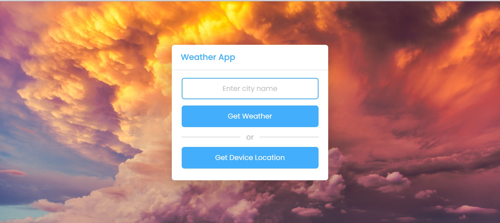
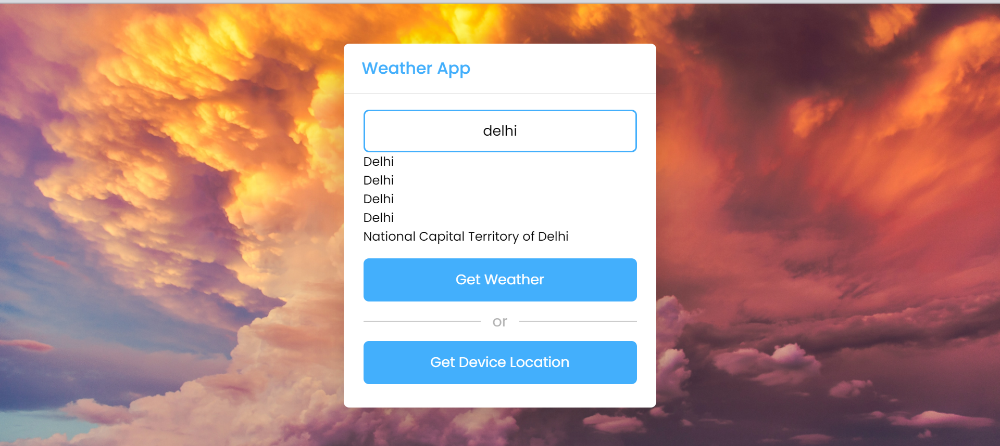
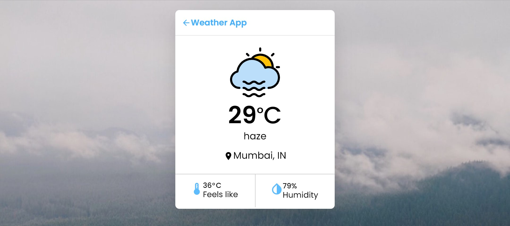
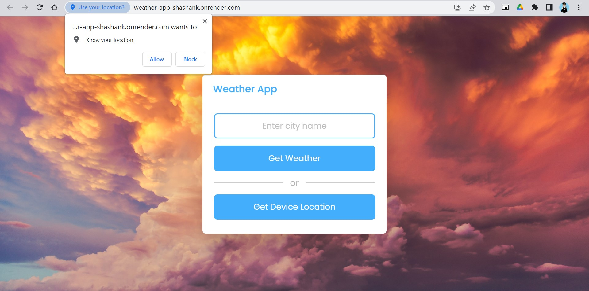

## Weather App 🌦️

Live site : https://weather-app-shashank.onrender.com/

This Weather App 🌤️ is a web application that allows users to get current weather information for a specific location. By entering the name of a city, users can retrieve real-time weather data including temperature, weather condition, humidity, and more. The app utilizes the OpenWeatherMap API to fetch weather data and provides a user-friendly interface to display the information.

Key Features:
-Enter the name of a city to retrieve weather data
-Displays the current temperature, weather condition, and humidity
-Provides a user-friendly interface with intuitive design
-Supports auto-suggestions for city names
-Allows users to get weather data based on their device's location

This Weather App is built using React, Axios for API requests, and integrates with the OpenWeatherMap API to fetch weather data. It offers a simple and convenient way to check the weather conditions for any location.

## Installation
1. Clone the repository: `git clone https://github.com/shashanky1502/React-Weather-App.git`
2. Install dependencies: `npm install`

## Technologies
1. React
2. OpenWeatherMap API

## Usage
1. Run the application: `npm start`
2. Open your web browser and visit: `http://localhost:3000`

## Screenshots
Here are some screenshots of the Weather App:

*Input city name or Zip code or select current location to view weather*

*auto-complete feature for the city name or ZIP code input field.*

*Weather details*

*show Current location weather only when location access is granted*
